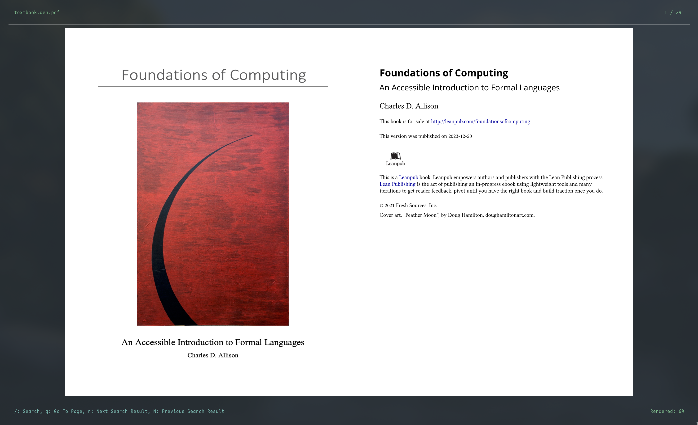

# `tdf`

A terminal-based PDF viewer.

Designed to be performant, very responsive, and work well with even very large PDFs. Built with [`ratatui`](https://github.com/ratatui-org/ratatui).

## Features:
- Asynchronous Rendering
- Searching
- Hot reloading
- Responsive details about rendering/search progress
- Reactive layout

## To Build
First, you need to install the system dependencies. This includes packages such as (but not limited to) `cairo`, `gtk`, and `poppler`. If you're on linux, these will probably show up in your package manager as something like `libcairo-devel` or `cairo-dev`.

If it turns out that you're missing one of these, it will fail to compile and tell you what library you're missing. Find the development package for that library in your package manager, install it, and try to build again. Now, the important steps:

1. Get the rust toolchain from [rustup.rs](https://rustup.rs)
2. Clone the repo and `cd` into it
3. Run `cargo build --release`

Alternatively, if you'd like to squeeze the most performance out of this tool, you'll want to run `bash ./scripts/build_most_optimized.sh` and pull the resulting binary from `./target/$target/tdf`.

## Why in the world would you use this?

I dunno. Just for fun, mostly.

## Can I contribute?

Yeah, sure. Please do.
